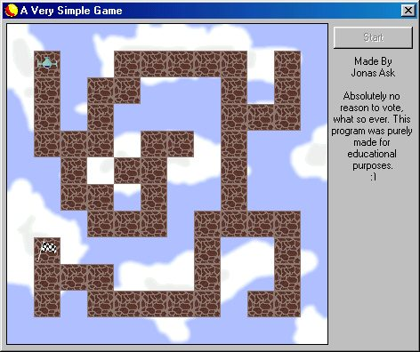



## Simple Game \- ShowHow

### Description

Do you want to make your own 5-min game? This Project shows how to use keyinput, sound, graphics, Mainloops, map from bmp and more. Good for looking up stuff :) Please give feedback! I love it!! ;) hehe
 
### More Info
 

             |
---                |---
**Submitted On**   |2001-08-07 17:18:56
**By**             |[Jonas Ask](https://github.com/Planet-Source-Code/PSCIndex/blob/master/ByAuthor/jonas-ask.md)
**Level**          |Beginner
**User Rating**    |4.7 (28 globes from 6 users)
**Compatibility**  |VB 6\.0
**Category**       |[Games](https://github.com/Planet-Source-Code/PSCIndex/blob/master/ByCategory/games__1-38.md)
**World**          |[Visual Basic](https://github.com/Planet-Source-Code/PSCIndex/blob/master/ByWorld/visual-basic.md)
**Archive File**   |[Simple Gam24222872001\.zip](https://github.com/Planet-Source-Code/jonas-ask-simple-game-showhow__1-25939/archive/master.zip)

### API Declarations

They're all in there, Bob!

